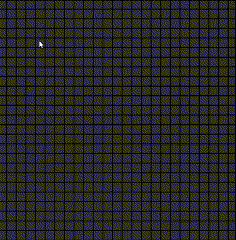

# Python Pathfinding Algorithm

This project is an interactive pathfinding algorithm implemented in Python using Tkinter and PyGame.

  

## Getting Started

To get started with this project, follow these steps:

1. Clone the repository: `https://github.com/BeulahLand24/Python-Pathfinding-Algorithm.git` 
Alternativly, you can download the file directly. 
2. Open the `PathfindingProject.py` script and execute.
3. Interact with the program:

- Place the starting location by pressing 'S' on your keyboard.
- Set the target location by left-clicking on the grid.
- Draw walls with right-click and drag to block the path.
- Delete targets, walls, and starting boxes by pressing 'D'
- Press the spacebar to start Dijkstra's search algorithm

*Note:* Drawing walls may require holding down the mouse button/key and moving the cursor over the grid box you intend to draw on. Future commits will focus on streamlining this feature.

## Contributing

Contributions are welcome. If you encounter any bugs or have improvements, feel free to submit pull requests or open issues.
